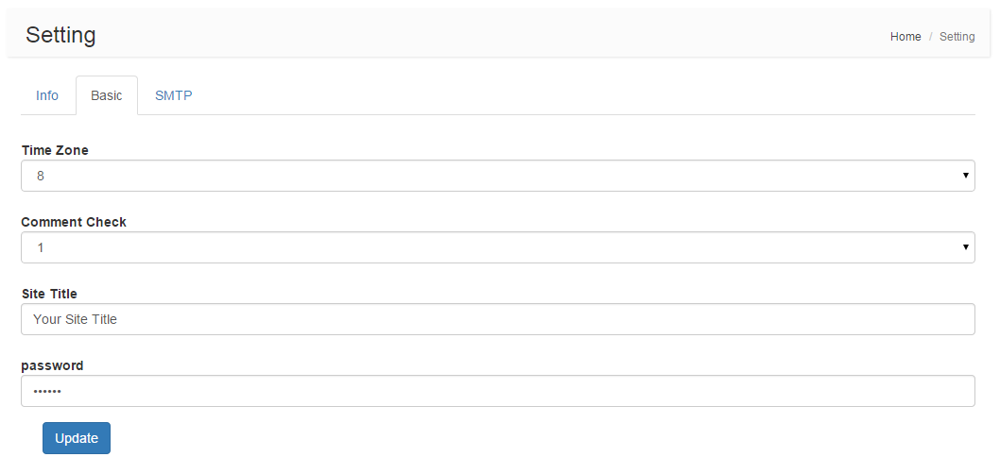

Yii2 Setting
=========
Yii2 Setting for other application, especially for [Yii2 Adminlte]

Add 3 feature
1. add textarea type
origin only have two types, input and select ,when you want input a long text , the input is not suitable, Now, add the textarea type.
So the types are `textarea`,`text`,`password`,`select`.
2. hiden parent node:
whene parent node's value is "hidden", that will not show in tabs;
3. query from cache
origin query the setting is from database such as mysql, it may slow, now can query from cache .

Installation
------------

The preferred way to install this extension is through [composer](http://getcomposer.org/download/).

Either run

```
php composer.phar require zhangyc/yii2-setting "dev-master"
```

or add

```
"zhangyc/yii2-setting": "dev-master"
```

to the require section of your `composer.json` file.


Usage
-----

Once the extension is installed, simply use it in your code by  :

### Migration

Migration run

```php
yii migrate --migrationPath=@zhangyc310/setting/migrations
```

### Config /common/config/main.php to use Yii::$app->setting
```php
    'components' => [
        'setting' => [
            'class' => 'zhangyc310\setting\Setting',
        ],
    ],
```

### Config backend modules in backend/config/main.php to manage settings

```php
    'modules' => [
        'setting' => [
            'class' => 'zhangyc310\setting\Module',
            'controllerNamespace' => 'zhangyc310\setting\controllers'
        ],
    ],
```


### Config at backend
backend : http://you-domain/backend/web/setting

### Add Your Setting
Setting support 3 type of setting: text, password, select.
You could add your setting by migration or insert to table `setting` manually.
```php
INSERT INTO `setting` (`id`, `parent_id`, `code`, `type`, `store_range`, `store_dir`, `value`, `sort_order`) VALUES
(11, 0, 'info', 'group', '', '', '', '50'),
(21, 0, 'basic', 'group', '', '', '', '50'),
(31, 0, 'smtp', 'group', '', '', '', '50'),
(1111, 11, 'siteName', 'text', '', '', 'Your Site', '50'),
(1112, 11, 'siteTitle', 'text', '', '', 'Your Site Title', '50'),
(1113, 11, 'siteKeyword', 'text', '', '', 'Your Site Keyword', '50'),
(2111, 21, 'timezone', 'select', '-12,-11,-10,-9,-8,-7,-6,-5,-4,-3.5,-3,-2,-1,0,1,2,3,3.5,4,4.5,5,5.5,5.75,6,6.5,7,8,9,9.5,10,11,12', '', '8', '50'),
(2112, 21, 'commentCheck', 'select', '0,1', '', '1', '50'),
(3111, 31, 'smtpHost', 'text', '', '', 'localhost', '50'),
(3112, 31, 'smtpPort', 'text', '', '', '', '50'),
(3113, 31, 'smtpUser', 'text', '', '', '', '50'),
(3114, 31, 'smtpPassword', 'password', '', '', '', '50'),
(3115, 31, 'smtpMail', 'text', '', '', '', '50');
```

### Use Your Setting
Once you set the value at the backend. Simply access your setting by the following code:

```php
echo Yii::$app->setting->get('siteName');
```

Preview:
-------

